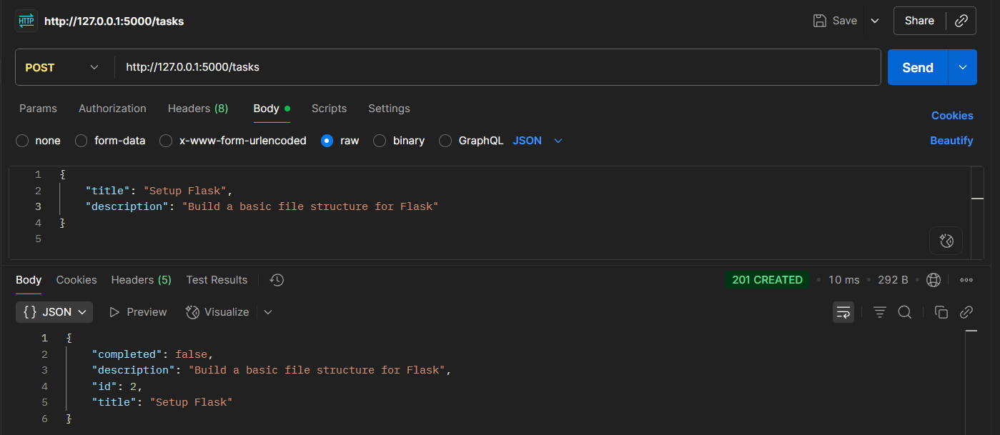

# 📝 Week3 Day1— [Oct6]

---

## Learning Topics
- Python basics
- Flask setup
- Project structure
- REST endpoints: GET, POST
## Task
- Setup Flask project
- Define folder structure (app folder, routes, static etc.)
- Basic “Hello world” route
- Implement GET /tasks and POST /tasks with dummy in‑memory storage
- Test via Postman or curl

## Gallery




---

## Steps Followed

-   Run the FLask app using 
```
Python app.py
```
-	Perform POST to add tasks in POSTMAN
-   Perform GET to get alist of added tasks
-   Perform PUT to update a particular task 
-   Perform DELETE to delete a particular task
-   Access tasks through IDs for example:
```
http://127.0.0.1:5000/tasks/1
```
- Optional filtering via a query is implemented which here is task completion